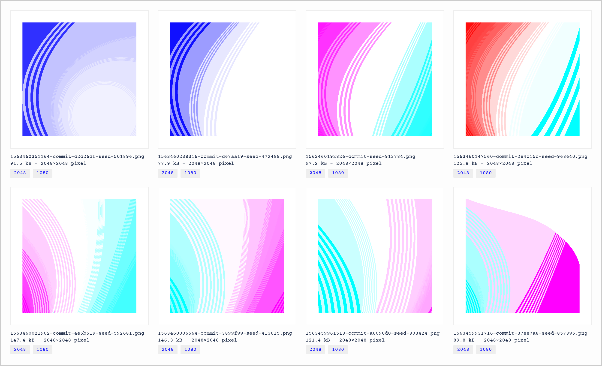

**Wiv** is a web image viewer. Display local images in your browser at https://wiv.vercel.app/.



## Get started

Install the dependencies...

```bash
npm install
```

...then start [Rollup](https://rollupjs.org):

```bash
npm run dev
```

Navigate to [localhost:5000](http://localhost:5000). You should see your app running. Edit a component file in `src`, save it, and reload the page to see your changes.

By default, the server will only respond to requests from localhost. To allow connections from other computers, edit the `sirv` commands in package.json to include the option `--host 0.0.0.0`.


## Building and running in production mode

To create an optimised version of the app:

```bash
npm run build
```

You can run the newly built app with `npm run start`.


---

*This project is [Svelte](https://svelte.dev) app.*


